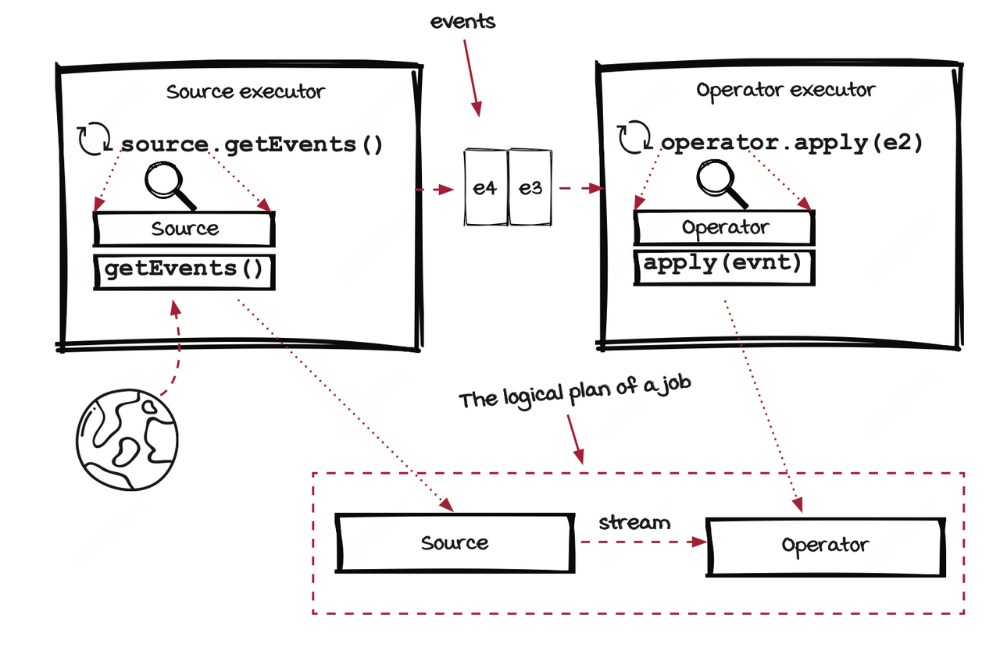
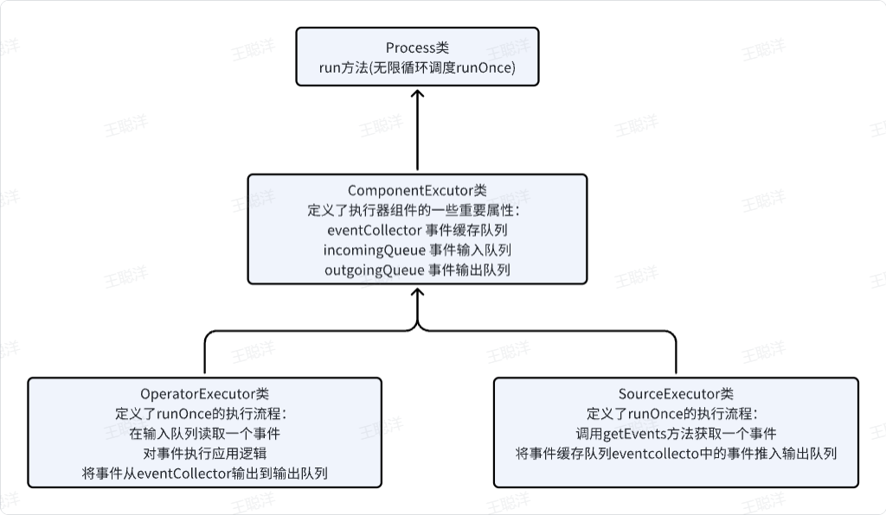

整体来看，engine的运行就是source executor不停执行我们定义的source以获取事件并推入输出事件队列，由一个connection组件(图中未画出)连接上游组件的输出流和下游组件的输入流。operator executor不停执行我们定义的operator以apply应用逻辑到事件。从而实现从源流式进入操作算子进行计算的逻辑执行计划。

👇以下是executor类的继承关系以及各自的核心作用：

